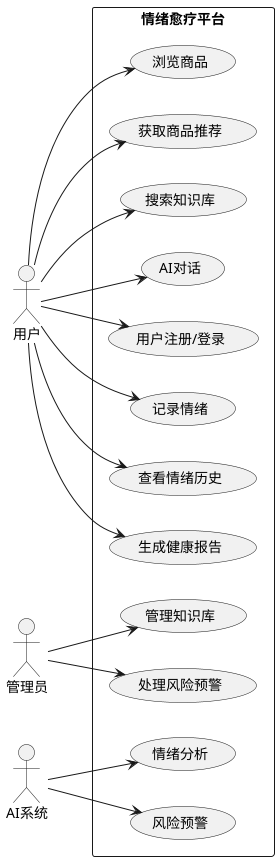

# 情绪愈疗平台 - 功能需求文档 (SRS)

## 1. 简介

### 1.1 目的
本文档旨在详细描述情绪愈疗平台的后端功能需求，为开发团队提供明确的技术实现指导。

### 1.2 范围
本系统是一个基于AI的情绪愈疗平台，提供情绪识别、健康报告、商城推荐、知识库查询和用户管理等核心功能。

---

## 2. 总体概述

### 2.1 软件概述
- **项目名称**：情绪愈疗平台 (AIGC Mood)
- **技术栈**：Python Flask + MySQL + SQLAlchemy + JWT
- **架构**：RESTful API

### 2.2 系统模块

| 模块 | 功能描述 |
|------|----------|
| 情绪识别 | 文本情绪分析、情绪记录、实时状态检测 |
| 健康报告 | 周报生成、趋势分析、洞察建议 |
| 商城推荐 | 商品管理、分类筛选、基于情绪的智能推荐 |
| 知识库 | 心理健康知识检索、管理（增删改查） |
| 用户认证 | 注册、登录、JWT令牌管理 |
| 数据安全 | 密码加密、数据脱敏、隐私保护 |

---

## 3. 具体需求

### 3.1 系统用例

### 3.2 情绪识别模块

#### 3.2.1 文本情绪分析

| 项目 | 内容 |
|------|------|
| **ID** | REQ-EMOTION-001 |
| **描述** | 对用户输入的文本进行情绪分析 |
| **输入** | `{"text": "用户文本", "user_id": 1, "use_ai": false}` |
| **处理** | 1. 优先调用AI分析（如百炼平台） 2. 降级为关键词匹配分析 |
| **输出** | 情绪类型(emotion)、置信度(confidence)、建议(advice) |
| **情绪类别** | joy(开心), sadness(悲伤), anxiety(焦虑), anger(愤怒), fear(恐惧), neutral(平静) |
| **业务规则** | AI分析失败时自动降级到关键词分析 |

#### 3.2.2 情绪记录

| 项目 | 内容 |
|------|------|
| **ID** | REQ-EMOTION-002 |
| **描述** | 保存用户情绪记录到数据库 |
| **输入** | `{"user_id": 1, "emotion": "开心", "score": 8.5, "text": "备注"}` |
| **验证规则** | emotion不能为空 score必须在0-10之间 |
| **输出** | 记录ID、创建时间 |
| **业务规则** | score≤3时自动触发风险预警 |

#### 3.2.3 情绪历史查询

| 项目 | 内容 |
|------|------|
| **ID** | REQ-EMOTION-003 |
| **描述** | 查询用户历史情绪记录 |
| **参数** | user_id, days(默认7), page, per_page |
| **输出** | 记录列表、分页信息 |

#### 3.2.4 情绪统计

| 项目 | 内容 |
|------|------|
| **ID** | REQ-EMOTION-004 |
| **描述** | 统计分析用户情绪数据 |
| **参数** | user_id, days |
| **输出** | 记录数、平均分、主要情绪、情绪分布、波动性、趋势、每日数据 |

---

### 3.3 健康报告模块

#### 3.3.1 周报生成

| 项目 | 内容 |
|------|------|
| **ID** | REQ-REPORT-001 |
| **描述** | 生成过去7天的情绪健康报告 |
| **认证** | JWT |
| **输出** | 周期、总记录数、平均分、主要情绪、情绪分布、趋势、波动性、洞察建议 |

#### 3.3.2 洞察建议生成

| 条件 | 建议内容 |
|------|----------|
| avg_score ≥ 8 | 本周情绪状态非常棒！继续保持积极心态 |
| avg_score ≥ 6 | 本周情绪状态良好，整体保持稳定 |
| avg_score ≥ 4 | 本周情绪有些波动，建议多关注自我照顾 |
| avg_score < 4 | 本周情绪偏低，建议寻求专业支持或与亲友交流 |
| volatility > 2 | 情绪波动较大，建议记录情绪触发因素 |
| 焦虑占比 > 30% | 焦虑情绪出现较频繁，可以尝试深呼吸或冥想 |
| 悲伤占比 > 30% | 悲伤情绪较多，建议多参与能带来快乐的活动 |
| 记录数 < 3 | 记录频率较低，建议每天记录1-2次情绪 |

---

### 3.4 商城模块

#### 3.4.1 商品列表

| 项目 | 内容 |
|------|------|
| **ID** | REQ-STORE-001 |
| **描述** | 获取商品/资源列表 |
| **参数** | category, keyword, emotion, page, per_page |
| **资源类型** | product(疗愈商品), meditation(冥想课程), article(文章), music(音乐), consultation(咨询) |

#### 3.4.2 商品CRUD

| 操作 | 路由 | 方法 |
|------|------|------|
| 创建 | /api/b-store/products | POST |
| 详情 | /api/b-store/products/{id} | GET |
| 更新 | /api/b-store/products/{id} | PUT |
| 删除 | /api/b-store/products/{id} | DELETE |

#### 3.4.3 分类管理

| 项目 | 内容 |
|------|------|
| **ID** | REQ-STORE-002 |
| **路由** | GET /api/b-store/categories |
| **输出** | 分类列表及中文名称 |

---

### 3.5 推荐引擎模块

#### 3.5.1 基于情绪的商品推荐

| 项目 | 内容 |
|------|------|
| **ID** | REQ-RECOMMEND-001 |
| **描述** | 根据用户当前情绪和历史情绪推荐商品 |
| **参数** | user_id, emotion, limit(默认10) |
| **推荐算法** | 1. 获取用户最近10条情绪记录 2. 构建情绪画像 3. 优先匹配当前情绪 4. 其次匹配历史积极情绪 5. 去重返回 |

#### 3.5.2 基于情绪的知识推荐

| 项目 | 内容 |
|------|------|
| **ID** | REQ-RECOMMEND-002 |
| **描述** | 根据情绪推荐相关知识文章 |
| **参数** | user_id, emotion, limit |

---

### 3.6 知识库模块

#### 3.6.1 知识检索

| 项目 | 内容 |
|------|------|
| **ID** | REQ-KNOWLEDGE-001 |
| **路由** | GET /api/b-knowledge |
| **参数** | keyword, category, page, per_page |
| **匹配字段** | title, content, tags |

#### 3.6.2 知识管理CRUD

| 操作 | 路由 | 方法 |
|------|------|------|
| 创建 | /api/b-knowledge | POST |
| 详情 | /api/b-knowledge/{id} | GET |
| 更新 | /api/b-knowledge/{id} | PUT |
| 删除 | /api/b-knowledge/{id} | DELETE |

#### 3.6.3 批量导入

| 项目 | 内容 |
|------|------|
| **ID** | REQ-KNOWLEDGE-002 |
| **路由** | POST /api/b-knowledge/batch |
| **输入** | `{"items": [{"category": "", "title": "", "content": ""}, ...]}` |

---

### 3.7 用户认证模块

#### 3.7.1 用户注册

| 项目 | 内容 |
|------|------|
| **ID** | REQ-AUTH-001 |
| **路由** | POST /api/b-auth/register |
| **输入** | username, password, email(可选) |
| **验证规则** | 用户名不能为空 密码长度至少6位 |

#### 3.7.2 用户登录

| 项目 | 内容 |
|------|------|
| **ID** | REQ-AUTH-002 |
| **路由** | POST /api/b-auth/login |
| **输入** | username, password |
| **输出** | user_id, username, email, JWT token |

#### 3.7.3 Token刷新

| 项目 | 内容 |
|------|------|
| **ID** | REQ-AUTH-003 |
| **路由** | POST /api/b-auth/refresh |
| **认证** | JWT |

---

### 3.8 数据安全模块

#### 3.8.1 数据加密

| 项目 | 内容 |
|------|------|
| **ID** | REQ-SECURITY-001 |
| **路由** | POST /api/b-security/encrypt |
| **认证** | JWT |
| **方法** | Base64 + XOR 加密 |

#### 3.8.2 数据脱敏

| 类型 | 示例 |
|------|------|
| 手机号 | 138****5678 |
| 身份证 | 310***********1234 |
| 邮箱 | a***@example.com |
| 姓名 | 张* |

#### 3.8.3 数据导出

| 项目 | 内容 |
|------|------|
| **ID** | REQ-SECURITY-002 |
| **路由** | GET /api/b-security/export |
| **认证** | JWT |
| **输出** | 用户信息、情绪记录、对话记录 |

#### 3.8.4 账户注销

| 项目 | 内容 |
|------|------|
| **ID** | REQ-SECURITY-003 |
| **路由** | DELETE /api/b-security/delete |
| **认证** | JWT |
| **处理** | 删除用户及所有关联数据 |

---

## 4. 接口需求

### 4.1 API接口汇总

| 模块 | 路由 | 方法 | 认证 |
|------|------|------|------|
| 情绪分析 | /api/b-emotion/analyze | POST | 可选 |
| 情绪记录 | /api/b-emotion/record | POST | 可选 |
| 情绪历史 | /api/b-emotion/history | GET | 可选 |
| 情绪统计 | /api/b-emotion/stats | GET | 可选 |
| 健康周报 | /api/b-emotion/weekly-report | GET | JWT |
| 商品列表 | /api/b-store/products | GET | - |
| 商品详情 | /api/b-store/products/{id} | GET | - |
| 商品创建 | /api/b-store/products | POST | - |
| 商品更新 | /api/b-store/products/{id} | PUT | - |
| 商品删除 | /api/b-store/products/{id} | DELETE | - |
| 分类列表 | /api/b-store/categories | GET | - |
| 商品推荐 | /api/b-recommend/products | GET | - |
| 知识推荐 | /api/b-recommend/knowledge | GET | - |
| 知识搜索 | /api/b-knowledge | GET | - |
| 知识详情 | /api/b-knowledge/{id} | GET | - |
| 知识创建 | /api/b-knowledge | POST | - |
| 知识更新 | /api/b-knowledge/{id} | PUT | - |
| 知识删除 | /api/b-knowledge/{id} | DELETE | - |
| 知识分类 | /api/b-knowledge/categories | GET | - |
| 用户注册 | /api/b-auth/register | POST | - |
| 用户登录 | /api/b-auth/login | POST | - |
| Token刷新 | /api/b-auth/refresh | POST | JWT |
| 数据加密 | /api/b-security/encrypt | POST | JWT |
| 数据脱敏 | /api/b-security/mask | POST | - |
| 数据导出 | /api/b-security/export | POST | JWT |
| 账户注销 | /api/b-security/delete | POST | JWT |

---

## 5. 数据字典

### 5.1 用户表 (users)

| 字段 | 类型 | 说明 |
|------|------|------|
| id | INT | 用户ID (主键) |
| username | VARCHAR(64) | 用户名 (唯一) |
| email | VARCHAR(120) | 邮箱 (唯一) |
| password_hash | VARCHAR(128) | 密码哈希 (Bcrypt) |
| user_type | ENUM | anonymous/registered |
| is_anonymous | BOOLEAN | 是否匿名用户 |
| avatar_url | VARCHAR(512) | 头像URL |
| created_at | DATETIME | 创建时间 |
| updated_at | DATETIME | 更新时间 |

### 5.2 情绪记录表 (emotion_records)

| 字段 | 类型 | 说明 |
|------|------|------|
| id | INT | 记录ID (主键) |
| user_id | INT | 用户ID (外键) |
| emotion | VARCHAR(32) | 情绪类型 |
| score | FLOAT | 情绪分数 (0-10) |
| text | TEXT | 备注文字 |
| created_at | DATETIME | 记录时间 |

### 5.3 知识库表 (knowledge_base)

| 字段 | 类型 | 说明 |
|------|------|------|
| id | INT | 知识ID (主键) |
| category | VARCHAR(64) | 知识分类 |
| title | VARCHAR(255) | 标题 |
| content | TEXT | 内容 |
| tags | VARCHAR(255) | 标签 |
| source | VARCHAR(128) | 来源 |
| created_at | DATETIME | 创建时间 |
| updated_at | DATETIME | 更新时间 |

### 5.4 资源表 (resources)

| 字段 | 类型 | 说明 |
|------|------|------|
| id | INT | 资源ID (主键) |
| type | ENUM | 资源类型 |
| title | VARCHAR(255) | 资源标题 |
| description | TEXT | 资源描述 |
| url | VARCHAR(512) | 资源链接 |
| applicable_emotions | VARCHAR(128) | 适用情绪 |
| created_at | DATETIME | 创建时间 |

### 5.5 风险预警表 (risk_alerts)

| 字段 | 类型 | 说明 |
|------|------|------|
| id | INT | 预警ID (主键) |
| user_id | INT | 用户ID |
| conversation_id | INT | 对话ID |
| risk_level | ENUM | low/medium/high/critical |
| risk_type | VARCHAR(64) | 风险类型 |
| content | TEXT | 风险内容 |
| alert_sent | BOOLEAN | 是否已发送通知 |
| handled | BOOLEAN | 是否已处理 |
| handled_by | VARCHAR(64) | 处理人 |
| created_at | DATETIME | 创建时间 |

---

## 6. 性能需求

### 6.1 响应时间
- API响应时间 < 2秒
- 知识库检索 < 1秒

### 6.2 并发支持
- 支持至少100个并发用户

### 6.3 可用性
- 系统可用性 > 99%

---

## 7. 附录

### 7.1 错误代码

| 错误码 | 说明 |
|--------|------|
| 200 | 成功 |
| 400 | 请求参数错误 |
| 401 | 未授权 |
| 403 | 禁止访问 |
| 404 | 资源不存在 |
| 500 | 服务器内部错误 |

### 7.2 情绪关键词映射

| 情绪 | 关键词 |
|------|--------|
| 开心 | 开心、快乐、高兴、幸福、棒、太好了、喜悦、欢乐、愉快 |
| 悲伤 | 难过、伤心、悲伤、忧郁、哭、痛苦、沮丧、失落、郁闷 |
| 焦虑 | 紧张、担心、焦虑、害怕、不安、恐慌、压力、烦恼 |
| 愤怒 | 生气、愤怒、恼火、气愤、发火、暴躁、不满、厌烦 |
| 平静 | 平静、安宁、放松、舒服、还好、宁静、和谐、轻松 |
| 恐惧 | 恐惧、害怕、恐慌、畏惧 |

---

**文档版本**: 1.0  
**创建日期**: 2026-03-11  
**项目**: 情绪愈疗平台 (AIGC Mood)
